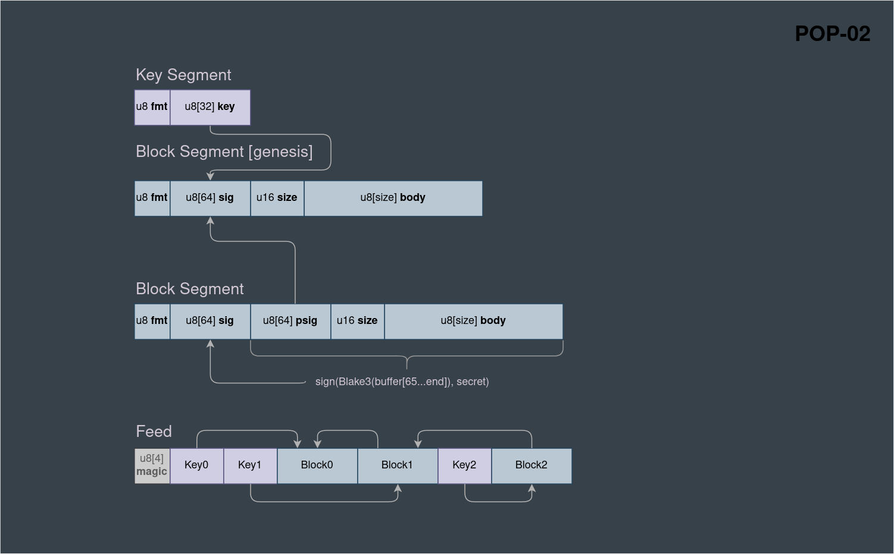

# POP-02: Binary Block and Chain

Purpose:
 - A **verifiable** and highly **transferable** data container.
 - Flat memory format, zero copy on read.
 - Append on write.
 - Compatiblity with most modern digital devices.
 - The simpler the better.

This spec describes 1 format byte and two types of segments: Key and Block.

## FMT

fmt is short for format.  
It is a single byte and hints the loader what kind of data to expect.

**bit values**  

Bit 7 being the highest bit and 0 the lowest.

| bit | name     | value                            |
|-----|----------|----------------------------------|
| 0   | Type     | `0`: KEY, `1`: BLOCK             |
| 1   | Genesis  | `0`: No PSIG, 1: PSIG after SIG  |
| 2   | Phat     | Size is `0`:  u16, `1`: u32      |
| 3   | Chain    | `0`: End of Chain, `1`: not last |
| 4   | RESERVED | Always `0`                       |
| 5   | RESERVED | Always `1`                       |
| 6   | RESERVED | Always `0`                       |
| 7   | RESERVED | Always `0`                       |

## Key Segment
POP-01 public keys presented in their binary form and prefixed with the ASCII char `(`.
`(<32bytes Public Key>`

<small>Sample in hex</small>
```
6aee2f22cacb2e49bbb0d54ff1d9d912323787d81f08e73bb61a215d04029299a1
```
<!-- Secret:
f1d0ea8c8dc3afca9766ee6104f02b6ea427f1d24e3e4d6813b09946dff11dfa
-->

## Block Segment
A block is a plain buffer containing data and a signature.

<small>Layout</small>
```
[fmt][sig][psig][size][data]
```

- `fmt` A single byte identifying the format of blocks
- `sig` Signature = `sign(blake3(psig + size + body))` // See POP-01
- `psig` Parent Signature: optional, 64 zeros denotes genesis block
- `size` two or four bytes. Lite 64KB / Phat (soft limit 16MB)
- `body` a buffer of data with length equal to `size`.

Note: `sig` is synonymous with `BlockID`

<small>Sample in hex</small>

```
504943302909649b2b6c323c19095b2bc69f1992e41e61e7364a048f07510b82046919be79be50c6bcd29cb6da13185446991d630bedef2326eaccc7ef0e8ebe7ff36c652500046861636b
```

### Block Header

The header starts with one byte that specifies the block format:

**Section offsets**

| Type         | Fmt Bin   | Fmt Char | @SIG | @PSIG | @SIZE | @BODY |
|--------------|-----------|----------|------|-------|-------|-------|
| Lite Genesis | 0010 0001 | !        | 1    | n/a   | 65    | 67    |
| Phat Genesis | 0010 0011 | #        | 1    | n/a   | 65    | 69    |
| Lite Child   | 0010 0101 | %        | 1    | 65    | 129   | 131   |
| Phat Child   | 0010 0111 | '        | 1    | 65    | 129   | 133   |
| KEY (32B)    | 0110 1010 | k        | n/a  | n/a   | n/a   | n/a   |

## Chain

A chain is a flat buffer that contains a set of keys and blocks  
where each subsequent block _Parent Signature_ equals the  
signature of it's predecessor.

This provides a simple way to transmit verifiable data between nodes.

All keys required to validate the chain _should_ be included, but a key _must_ never
occur after a block that depends on it.

When a chain is stored or transfered over an unlikely medium,
then the start of chain **can** be denoted using the following magic-bytes:

| Magic | Hex            | Description                   |
|-------|----------------|-------------------------------|
| PIC0  | 80, 73, 67, 48 | Pico Internet Chain version 0 |


<small>Example: hex encoded chain with 1 key and 2 blocks</small>

```
6aee2f22cacb2e49bbb0d54ff1d9d912323787d81f08e73bb61a215d04029299a12109649b2b6c323c19095b2bc69f1992e41e61e7364a048f07510b82046919be79be50c6bcd29cb6da13185446991d630bedef2326eaccc7ef0e8ebe7ff36c652500046861636b2b14b5e829984a3dcd62f9983a56aa4f6eb6ba0a2c62e0b382fbf1b674a45b69b725ea41ce9622ffa1c35c3ff251d7dac4fbfa744cc76afbd84557a869544cef5a09649b2b6c323c19095b2bc69f1992e41e61e7364a048f07510b82046919be79be50c6bcd29cb6da13185446991d630bedef2326eaccc7ef0e8ebe7ff36c65250006706c616e6574
```
<sup>If you can decode this, well done.</sup>

---


